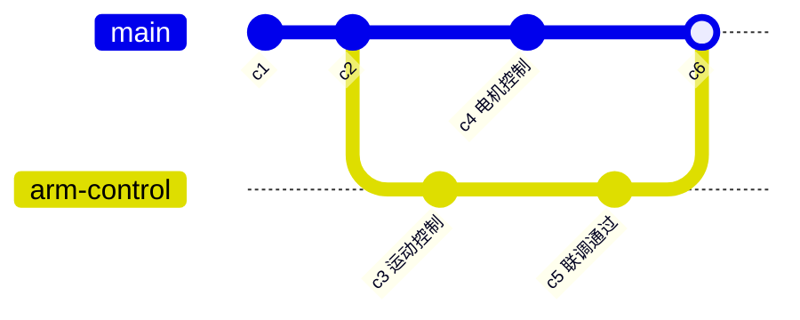
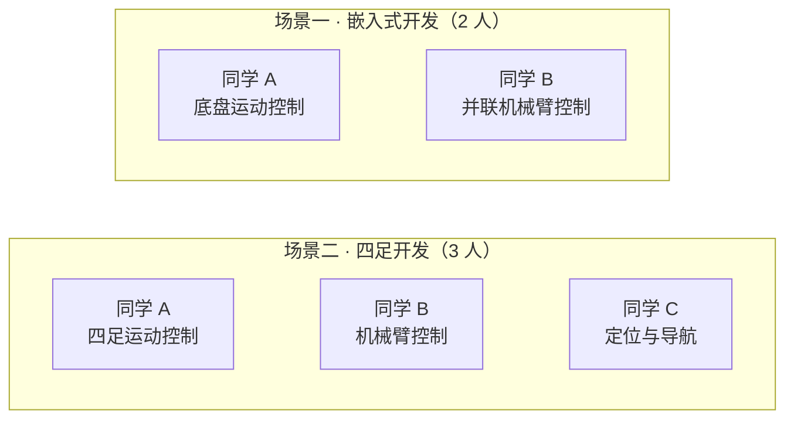
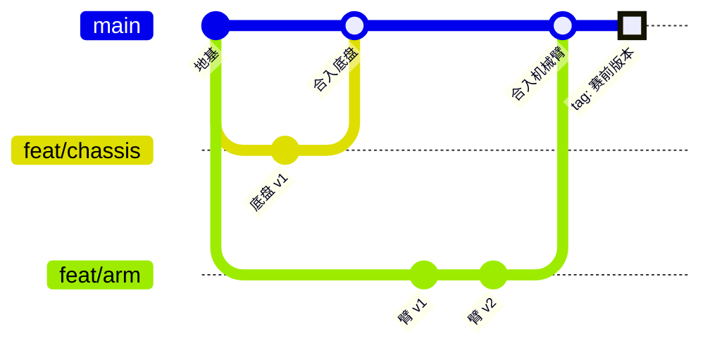
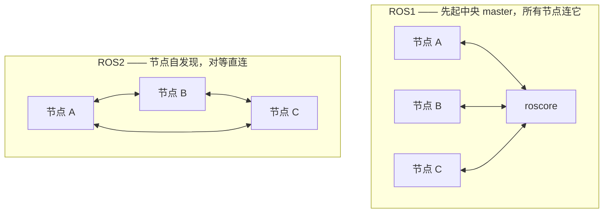
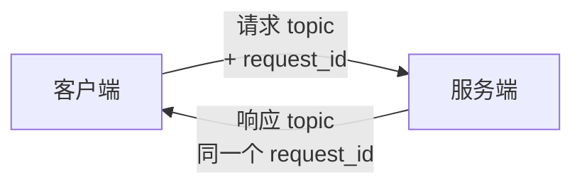
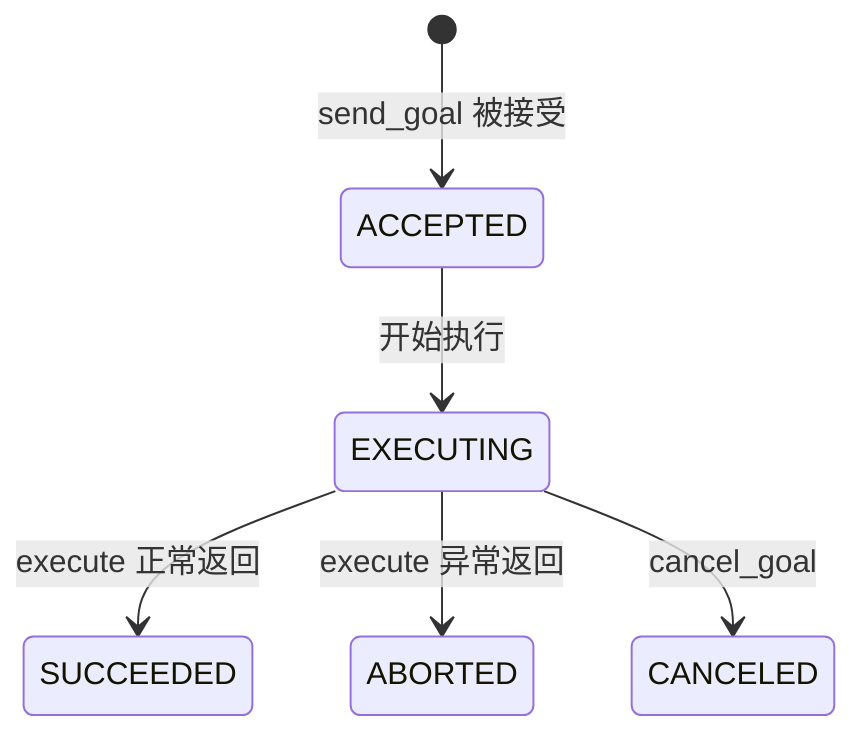

# 电控组培训第 7 讲

<div class="text-center text-3xl">

Git & ROS2 & Robot Arm Manipulation

</div>

<div class="abs-br m-6 text-sm text-right">
  <div>孙博奕 / 2026.9</div>
  <div>wechat: sby2272455958</div>
  <div>github: sunboy0303</div>
</div>

---

# A Note Before We Begin: My Advice on Using AI

<div class="mt-8 space-y-8">

<div>
<div class="text-2xl font-semibold">AI is still just a tool — it cannot solve every problem for you, especially those requiring physical interaction; its power depends not only on the model's capability, but even more on the person wielding it.</div>
<div class="mt-1 text-base font-medium text-primary">AI目前来看还只是一个工具，无法帮你解决所有需要和物理产生交互的问题，他的主要威力不仅取决于模型的能力更取决于使用它的人</div>
</div>

<div>
<div class="text-2xl font-semibold">You should always know what you are asking the AI to do and what it actually does; when the AI's actions exceed the boundaries of your own capabilities, it means you have lost control of the code.</div>
<div class="mt-1 text-base font-medium text-primary">你应该时刻知道你在让AI做什么，AI做了什么，当AI所做的事情超出你的能力边界，也就意味着你对这份代码失去了掌控</div>
</div>

</div>

<div class="mt-8 text-center text-2xl font-bold text-red-500">Always Maintain the Ability to Detect When AI is Deceiving You !!</div>


---

## Contents

- Git
  - Personal Repository Version Control
  - Branches & Merge
  - Daily Tips & .gitignore
  - Advanced Git: Hooks, CI & CD
  - Group Standard Develop WorkFlow
- ROS2
  - Why Develop Robots Should We Use ROS2
  - Topic: Publisher and Subscription
  - Service & Action: Client and Server
  - ROS2 Control
  - ROS2 Effective Develop of Team Collaboration 
- Robot Arm Manipulation
  - Rotation Matrix
  - Coordinate Transformation in Homogeneous Space
  - Forward & Inverse Kinematics
  - Jacobian Matrix
  - Dynamics

---
layout: section
---

# Git

Distributed version control

---

## Personal Repository Version Control

<div class="mt-16 space-y-8 text-xl leading-loose tracking-wide">

设想一个我们用代码开发的实际场景，你在RC被安排和sby合作开发机械臂控制的项目，你负责做机械臂的运动控制，也就是告诉每一个电机你应该转到什么角度可以让我的机械臂的末端到达空间中的点(a, b, c)，然后sby负责去写电机控制，也就是把你得到的每一个电机的实际角度用对应电机厂家发给你的控制协议，变成电机读取的信息形式，让电机正确运动。

但是sby很笨，每次都只会发给你一个他开发好的zip压缩包，你每一次都要解压缩，然后把他各种各样的文件复制到你的项目中，才可以测试。

终于有一次，你好不容易在9.31基于sby 9.1号的代码实现了整个机械臂的运动控制，结果sby反手发给你了一个zip文件，名字叫 Version_0931.zip 你气愤地通宵把他新的代码和你的合并起来，colcon build 发现200个Error，你的天塌了...

</div>

---

## Why We Need Git

- **更新迭代频繁** — 每次保存都是一个新版本，`Version_0931.zip` 式命名很快就会失控
- **多人协作** — 你的代码建立在队友的代码之上，需要不断把对方的更新合并进自己的项目
- **多设备、跨平台** — 笔记本上开发，NX / STM32 上部署，代码需要在设备之间同步
- **海量小文本文件** — 两个版本之间往往只差几行，靠复制整个文件夹既看不清"改了什么"，也极易覆盖出错
- **需要随时回退** — 今天改崩了，必须能立刻回到昨天还能跑的版本

<v-click>

<div class="mt-8 text-center text-xl font-bold text-primary">
记录每一次改动 · 合并多人的工作 · 回到任意历史版本
</div>

</v-click>

---

## Git Basics: The Four Areas

<div class="flex justify-center">


</div>

- **工作区 Working Directory** — 你正在编辑的项目文件夹
  - <span class="text-red-500">`git status`</span> · `git diff` · `git restore <file>`
- **暂存区 Staging Area** — 待提交改动的"购物车"，先挑好这次要提交什么
  - <span class="text-red-500">`git add <file>`</span> · <span class="text-red-500">`git add .`</span> · `git restore --staged`
- **本地仓库 Local Repository** — 项目里的 `.git` 目录，把改动永久写入历史，全程不需要网络
  - <span class="text-red-500">`git commit -m "msg"`</span> · `git log --oneline` · `git reset --hard`
- **远程仓库 Remote Repository** — GitHub / Gitee / 自建 gitlab 等，团队共享的中枢
  - <span class="text-red-500">`git clone <url>`</span> · <span class="text-red-500">`git push`</span> · <span class="text-red-500">`git pull`</span> · <span class="text-red-500">`git fetch`</span>

<div class="text-sm opacity-70"><span class="text-red-500">红色命令</span> = 必须熟练掌握</div>


---

## Git Basics: Branches

**分支 Branch** — 指向某个 commit 的可移动指针，从它拉出一条**独立时间线**单独开发，互不干扰，做完再合回主线；主干随时保持可用

<div class="flex justify-center">



</div>

- <span class="text-red-500">`git branch`</span> · <span class="text-red-500">`git checkout -b <name>`</span> · <span class="text-red-500">`git checkout <name>`</span> · `git switch -c <name>` · `git switch <name>` · `git branch -d <name>`

---

## Git Basics: Merge & Conflicts

**合并 Merge** — <span class="text-red-500">`git merge <branch>`</span> 把另一条分支的改动并入当前分支

- 双方改的是**不同位置** → Git 自动合并
- 双方改了**同一处** → 产生**冲突 conflict**，Git 停下来等你裁决

```bash
<<<<<<< HEAD            # 你这边的版本
你的运动控制代码
=======                # 分隔线，两边只能留一个
sby 的电机控制代码
>>>>>>> motor-driver    # 对面的版本
```

**解决冲突**：`git status` 定位冲突文件 → 手动编辑取舍、删掉 `<<<` `===` `>>>` 标记 → `git add <file>` → `git commit`

<div class="text-sm opacity-80">

还没改完想放弃，`git merge --abort` 恢复到合并前；想看分支图，`git log --graph --oneline --all`

</div>

---

## Git Tips: Daily Rescue Kit

按**真实场景**记命令，比背参数有效得多：

- **改到一半，突然要切分支救人** — `git stash` · `git stash pop`
- **最后一条提交信息写错了** — `git commit --amend`
- **要撤销已经 push 的提交** — `git revert <commit>`，生成一条反向提交；公共历史不要用 `reset` 强改
- **只想要另一个分支的某一个 commit** — `git cherry-pick <commit>`
- **`reset --hard` 之后后悔了** — `git reflog` 记录着 HEAD 走过的每一步，找回 commit 号再 reset 回去
- **赛前锁定一个能跑的版本** — `git tag robocup-0930` · `git push --tags`，比赛现场随时 `git checkout` 回这个版本
- **这行坑爹代码是谁写的** — `git blame <file>`（标准用法：甩锅，以及找原作者问上下文）

---

## .gitignore & Big Files

**ROS2 项目第一天就该做的事** — colcon 的编译产物绝不进仓库：

<div class="must-master">

```bash
# .gitignore
build/
install/
log/
__pycache__/
*.pyc
.vscode/
```

</div>

<style>
.must-master pre, .must-master code, .must-master span {
  color: #ef4444 !important;
}
</style>

- 已经被 track 的文件，加进 `.gitignore` **不会**自动忽略，要先 `git rm -r --cached <dir>` 再提交
- 几十 MB 的大文件（onnx 模型 / PCB / CAD / 视频）不要硬塞仓库，会拖慢所有人 clone —— 用 **Git LFS**：`git lfs track "*.onnx"`

---

## Advanced Git: Hooks

**Git Hooks** — `.git/hooks/` 目录下的脚本，Git 会在特定动作的节点自动执行；脚本以非零退出码结束，该动作就被**阻断**

| Hook | 触发时机 | 组里能干什么 |
|---|---|---|
| `pre-commit` | commit 之前 | 跑 clang-format / lint，没格式化好就不许提交 |
| `commit-msg` | 写完提交信息后 | 检查提交信息是否符合组内规范（如 `feat: xxx`） |
| `pre-push` | push 之前 | 先 `colcon build` + 跑测试，编译不过就推不出去 |

```bash
# .git/hooks/pre-commit —— 记得 chmod +x 加上执行权限
colcon build --packages-select arm_control || exit 1
```

<div class="text-sm opacity-80">

注意：`.git/hooks/` 不会被提交到版本库 —— 想让全组统一配置，用 [pre-commit](https://pre-commit.com) 框架，把 `.pre-commit-config.yaml` 提交进仓库即可

</div>

---

## Advanced Git: Automated Tests & CI

- **单元测试** — gtest（C++）/ pytest（Python），ROS2 中 `colcon test` 一键运行所有包的测试
- **本地拦截** — `pre-push` hook：测试不过，代码就出不了你的电脑
- **远端拦截（CI）** — GitHub Actions：push / PR 自动触发构建 + 测试，红了就不许合并

```yaml
# .github/workflows/ci.yml
on: [push, pull_request]
jobs:
  build-and-test:
    runs-on: ubuntu-latest
    steps:
      - uses: actions/checkout@v4
      - run: colcon build
      - run: colcon test && colcon test-result --verbose
```


---

## CD: Continuous Delivery / Deployment

- **CI（上一页）** — push / PR 自动构建 + 测试，回答"这次改动能不能合"
- **CD（本页）** — 验证通过后把**交付**也自动化：打 tag 自动发版打包，不用任何人手动搬文件

```yaml
# .github/workflows/release.yml —— 打 tag 自动发 Release
on:
  push:
    tags: ["v*"]          # 只有推 v 开头的 tag 才触发
jobs:
  release:
    runs-on: ubuntu-latest
    steps:
      - uses: actions/checkout@v4
      - run: colcon build
      - run: tar czf arm-control-${{ github.ref_name }}.tar.gz install/
      - uses: softprops/action-gh-release@v2
        with:
          files: arm-control-*.tar.gz
```

- 比赛现场：`git checkout v1.0` 或直接下载 Release 附件 —— 彻底告别微信传 zip
- 进阶：CI 构建成 **Docker 镜像** 推到 registry，Orin NX / 服务器直接 `docker pull`

---

## Group Workflow: Two Typical Teams

3 人左右的小团队、模块边界清晰、每人 own 一个模块 —— 这是 RC 电控组最常见的两种形态：

<div class="flex justify-center">



</div>

**共同点**：人数少、每人负责一个独立模块、模块之间只靠**少量接口**通信 —— 这个特点直接决定了下面的仓库结构、分支策略和合并节奏

**但两种场景不能套同一套形态**：Git 层面的骨架（分支 / PR / CI / tag）完全通用；**仓库结构和接口形态**不同 —— 嵌入式没有 colcon 包和 topic，下面每一步都分 ROS2 与嵌入式两轨

---

## Group Workflow: Step 1 — 搭好地基

开工第一天，一人牵头把**基建**做进仓库，其他人 clone 即得同款环境。目录结构分两轨：

<div class="text-sm">

**ROS2 场景 — colcon 工作区**

```bash
robot_ws/
├── src/chassis_control/     # 同学 A 的包
├── src/arm_control/         # 同学 B 的包
├── src/robot_interfaces/    # 接口包（下一页）
├── src/bringup/             # 联调启动（共用）
├── .gitignore               # build/ install/ log/
└── .pre-commit-config.yaml  # 统一 hooks
```

**嵌入式场景 — 裸机 / RTOS 工程**

```bash
firmware/
├── bsp/ + drivers/      # 时钟/外设/电机驱动（共用，指定 owner）
├── chassis/             # 同学 A：底盘任务
├── arm/                 # 同学 B：机械臂任务
├── app/                 # RTOS 任务创建与调度
├── .gitignore           # build/ *.o *.axf Objects/ Listings/
└── .pre-commit-config.yaml
```

</div>

- **一人一个模块目录** —— 目录边界就是责任边界，从源头避免互相踩脚
- 配置全部**提交进仓库**：hooks 用 pre-commit 框架才会"跟人走"，新人 clone 完零配置直接干活
- **main 分支加保护**：不许直接 push，只能 PR 合入 —— 呼应上一节的 CI 红灯拦截

---

## Group Workflow: Step 2 — 先定接口，再各自开发

模块交界处是队友之间**唯一的耦合点**，开工前必须先商量好：**我该如何调用你的部分？** 两种场景接口形态不同，原则相同：

**ROS2 场景** — 接口 = topic / service / action，统一放进 `robot_interfaces` 包：

```yaml
# 例：四足场景的交界
/cmd_vel            # 导航(C) → 四足运动控制(A)：速度指令
/arm/set_end_pose   # 上层 → 机械臂控制(B)：service，设定末端位姿
```

**嵌入式场景** — 接口 = 头文件 API + 消息队列，外加一张**硬件资源划分表**：

```c
// chassis.h —— 底盘模块对外只暴露这一个头文件
void chassis_set_velocity(float vx, float vy, float wz);
bool chassis_get_odom(odom_t *odom);
```

- 嵌入式的**资源划分表**写进 README：CAN1→底盘、CAN2→机械臂、SPI3→IMU、任务周期与优先级 —— RTOS 任务共享中断和外设，这张表就是模块边界
- 开发期先给 **stub**：ROS2 发假 topic，嵌入式返回假 odom —— 队友进度互不阻塞

---

## Group Workflow: Step 3 — 日常循环与合入

**每人一条 feature 分支，小步快合，main 永远保持能跑：**

<div class="flex justify-center">



</div>

- 分支命名 `feat/chassis-xxx`、`feat/arm-xxx` —— 一眼可读
- **每天开工先 `git pull` 同步 main**；功能一完成立刻合回去 —— 拖两周再合并，冲突就是灾难
- 合并走 **PR**：CI 全绿 + 负责整车项管队友 review，才允许合入 main
- 直接在main代码上做的修改要在 main 上打 tag，联调出问题随时整体回退

---

## Group Workflow: 嵌入式的深坑

RTOS 工程的模块边界比 ROS2 **模糊得多** —— 任务共享中断、外设、内存，冲突面更大，规范要沿开发链路一环环定死：**统一环境 → 防代码冲突 → 严管底层 → 把住合入 → 发布可查**

- **编译器版本全组统一** — `arm-none-eabi-gcc` 的版本号写进 README、配一键安装脚本；版本不一致就是同一份代码两个结果，"我这能编译你那报错"的玄学问题永远查不完
- **生成代码是冲突重灾区** — CubeMX 的 `.ioc` 和 `main.c` 谁重新生成一次就全变：外设分配定好后**不许各自 regenerate**，手写代码只放 `/* USER CODE */` 区块
- **底层一动全身** — `bsp/` `drivers/` 是公共地板：改这里必须走 PR + 另一人 review；现场出问题第一反应 `git log bsp/` 看最近改动
- **任何人的 PC 都要能过完整编译** — 这是合入 main 的底线，编不过的代码不许 push；CI 替你把这道关：Actions 里装同版本工具链交叉编译，逻辑测试把寄存器 mock 掉跑在 PC 上（Unity / CMock）
- **固件版本一致且永远可查** — tag → CI 自动把 `.hex` / `.bin` 附到 Release，每台车刷的哪个 tag 一查便知；赛前所有车统一刷到同一个 tag

---
layout: section
---

# ROS2

The standard framework for robot development: communication, building tool and ecosystem out of the box.

---

## Why Develop Robots Should We Use ROS2

**任何一个智能机器人，都由同样的五层构成：感知 → 决策 → 规划 → 控制 → 执行**

<div class="text-sm">

以 RoboCon 四足机器人搬运方块为例 —— 每一层在这个任务里分别是什么：

| 层 | 回答的问题 | 这个任务里是什么 |
|---|---|---|
| **感知** Perception | 环境和自身现在什么状态？ | RGBD 相机找方块位置；LiDAR + IMU 定机器人位姿 |
| **决策** Decision | 现在该做什么？ | 任务状态机：移动到抓取点 → 抓取 → 搬运 → 放置 |
| **规划** Planning | 具体怎么做？ | 全局路径规划器（怎么走到方块旁）；机械臂运动规划器（怎么动到方块） |
| **控制** Control | 怎么实时稳定地跟踪？ | 四足步态 / 平衡控制器；机械臂关节伺服 |
| **执行** Execution | 真正做功的硬件 | 机械臂 + 四足的所有关节电机 |

</div>

**这么多模块是怎么一起跑起来的？—— 多进程**：每一个部分都是一个独立进程，单独处理自己的信息，再和其他模块相互通信、交换信息。这个框架、这个交换信息的平台，就是 **ROS2**。

<v-click>

<div class="mt-4 text-center text-2xl font-bold text-red-500">ROS2 不是多么神奇的东西 —— 核心只是一个通信的媒介</div>

<div class="mt-4 text-center text-base font-medium text-primary">但随着工具逐渐强大、生态逐渐完善：colcon 构建 · tf2 坐标变换 · RViz 可视化 · rosbag 录制回放 · launch 一键启动 · ros2_control · MoveIt —— 今天的 ROS2 早已不单纯是一个多进程通信工具</div>

</v-click>

---

## What Changed: ROS1 → ROS2

**最大的变化：不再需要 roscore 了**

<div class="flex justify-center">



</div>

- ROS1 的 master 一挂，整个系统瘫痪；ROS2 基于 DDS **自发现**，节点直接对话 —— **没有单点故障**
- 其余大致差异：**QoS** 可按话题定制（控制指令走可靠通道、图像流允许丢包）；平台更广，**micro-ROS** 能直接跑在 MCU 上

<div class="mt-6 text-center text-2xl font-bold text-red-500">ROS1 已逐渐淘汰 —— 只需要学习 ROS2 即可</div>

---

## Topic: Publisher and Subscription

**场景接第 1 页**：规划层算出"机器人该怎么走"，把速度指令**单向、持续**地发给四足运动控制器 —— 这就是 Topic

<div class="grid grid-cols-2 gap-2 compact-code">

```python
# 发布者 —— 规划节点
import rclpy
from geometry_msgs.msg import Twist
rclpy.init()
node = rclpy.create_node('planner')
pub = node.create_publisher(Twist, '/cmd_vel', 10)
def tick():               # 10 Hz 持续发布
    msg = Twist()
    msg.linear.x = 0.5    # 前进 0.5 m/s
    pub.publish(msg)
node.create_timer(0.1, tick)
rclpy.spin(node)          # 持续运行
```

```python
# 订阅者 —— 四足控制节点
import rclpy
from geometry_msgs.msg import Twist
def on_cmd(msg):          # 收到消息，自动回调
    print(f'vx = {msg.linear.x}')
rclpy.init()
node = rclpy.create_node('locomotion')
node.create_subscription(Twist, '/cmd_vel', on_cmd, 10)
rclpy.spin(node)          # spin：分发回调
```

</div>

**实现一次 Topic 通信，代码里数出四样东西**：

- **消息类型** `Twist` —— 数据格式的<span class="text-red-500">合同</span>，两端用同一个类型
- **话题名** `/cmd_vel` —— 命名的<span class="text-red-500">频道</span>，对上同一频道才能收到
- **QoS** `10` —— 通信策略（缓存最近 10 条），入门照抄
- **回调 + `spin()`** —— 消息到达进队列，spin 取出，<span class="text-red-500">自动触发回调</span>

---

## Topic: 背后机制

<div class="mt-2 space-y-4 text-lg leading-normal">

<div>

**① 命名的广播电台** —— 发布者只管发，<span class="text-red-500">不知道谁在听</span>；订阅者只管收，<span class="text-red-500">不知道谁在发</span>，两端彻底解耦：一边崩了另一边照常跑

</div>

<div>

**② 怎么找到彼此 —— DDS 两步自发现（没有中心）**：每个节点进程是一个 DDS Participant，启动后先<span class="text-red-500">组播自介绍</span>互相认识，再交换各自有哪些 writer / reader；<span class="text-red-500">topic + 类型 + QoS</span> 都匹配的自动配对，从此点对点直连 —— 这就是不再需要 roscore 的底层

</div>

<div>

**③ 消息怎么到 —— 一条 DDS 管道**：

<div class="flex justify-center">


</div>

队列的长度与可靠性，就是 **QoS 生效的地方**（`10` = 最多缓存 10 条）

</div>

<div>

**④ 术语对应** —— `create_publisher` → DataWriter · `create_subscription` → DataReader · `ROS_DOMAIN_ID` → 隔离的域（域不同，互相看不见）

</div>

</div>

<div class="mt-4 text-base">调试三连：<span class="text-red-500 font-bold">`ros2 topic list`</span> · <span class="text-red-500 font-bold">`ros2 topic echo /cmd_vel`</span> · `ros2 topic hz /cmd_vel`</div>

<div class="mt-2 text-xs opacity-60">真实工程里节点通常写成 class 继承 Node —— 上一页取最简写法，聚焦通信 API</div>

---

## Service: Client and Server

**接场景**：上层要机械臂运动到抓取位姿 —— 必须**等到确认结果**才能走下一步，这种"一问一答"就是 Service

<div class="grid grid-cols-2 gap-2 compact-code">

```python
# 服务端 —— 机械臂控制节点
import rclpy
from robot_interfaces.srv import SetEndPose
def handle(req, res):    # 收到请求
    res.success = move_to(req.pose)
    return res           # 必须返回响应
rclpy.init()
node = rclpy.create_node('arm_control')
node.create_service(SetEndPose, 'set_end_pose', handle)
rclpy.spin(node)
```

```python
# 客户端 —— 上层任务节点
import rclpy
from robot_interfaces.srv import SetEndPose
rclpy.init()
node = rclpy.create_node('task_node')
cli = node.create_client(SetEndPose, 'set_end_pose')
cli.wait_for_service()                # 等对方在线
fut = cli.call_async(
    SetEndPose.Request(pose=target))  # 发出请求
rclpy.spin_until_future_complete(node, fut)
print('到位了吗:', fut.result().success)
```

</div>

**实现一次 Service 通信，需要四样东西**：

- **服务类型** `SetEndPose.srv` —— `---` <span class="text-red-500">上请求、下响应</span>；自定义接口放 `robot_interfaces` 包
- **服务名** `set_end_pose` —— 两端对上同一个名字
- **服务端** `create_service(类型, 名, 回调)` —— 回调收 `req`，处理完<span class="text-red-500">必须返回</span> `res`
- **客户端** `create_client` + `call_async` —— 拿 future，`spin_until_future_complete` 等结果

---

## Service: 背后机制

<div class="mt-2 space-y-4 text-lg leading-normal">

<div>

**① 远程函数调用** —— 客户端"调用"，服务端"执行并返回"，<span class="text-red-500">一问必有一答</span>：调用方拿到确认才继续

</div>

<div>

**② 底层拆开 —— 一对 topic + 请求 ID 配对**：

<div class="flex justify-center">



</div>

客户端发出请求时记下 id、拿一个 future 挂起等待；响应带着<span class="text-red-500">同一个 request_id</span> 回来，配对成功才填充 future —— `call_async` 返回的 future 就是这么实现的

</div>

<div>

**③ 服务强制可靠传输** —— 请求、响应一条都不能丢，所以默认 <span class="text-red-500">RELIABLE</span> QoS；topic 才允许选"丢了也行"的 best-effort

</div>

<div>

**④ 单线程回调** —— 默认一次只处理一个请求：回调里干长活会<span class="text-red-500">堵死整个服务</span>，这正是 Action 存在的理由（后面两页）

</div>

</div>

<div class="mt-4 text-base">调试：<span class="text-red-500 font-bold">`ros2 service list`</span> · `ros2 service call /set_end_pose robot_interfaces/srv/SetEndPose "..."`</div>

---

## Action: Client and Server

**接场景**：决策层给四足下发"导航到方块旁" —— **耗时长、要进度、可中途取消**

<div class="grid grid-cols-2 gap-2 compact-code">

```python
# 动作端 —— 导航节点
import rclpy
from rclpy.action import ActionServer
from robot_interfaces.action import GoToPose
def execute(goal):               # 长任务写这里
    for i, step in enumerate(PATH):
        move(step)
        goal.publish_feedback(   # 持续汇报进度
            GoToPose.Feedback(progress=i / len(PATH)))
    return GoToPose.Result(success=True)
rclpy.init()
node = rclpy.create_node('navigator')
ActionServer(node, GoToPose, 'go_to_pose', execute_callback=execute)
rclpy.spin(node)
```

```python
# 客户端 —— 决策节点
import rclpy
from rclpy.action import ActionClient
from robot_interfaces.action import GoToPose
rclpy.init()
node = rclpy.create_node('task_node')
cli = ActionClient(node, GoToPose, 'go_to_pose')
cli.wait_for_server()
fut = cli.send_goal_async(
    GoToPose.Goal(target=goal_pose))  # 下发目标
rclpy.spin_until_future_complete(node, fut)
handle = fut.result()      # 任务凭据，不是结果
r = handle.get_result_async()
rclpy.spin_until_future_complete(node, r)
```

</div>

- **三段式定义** `GoToPose.action` —— 两根 `---` 分隔 <span class="text-red-500">goal / result / feedback</span>
- **服务端** `execute_callback` —— 长任务写这里，随时 `publish_feedback`
- **客户端拿 goal handle** —— <span class="text-red-500">任务凭据，不是结果</span>，可 `cancel_goal()` 取消

---

## Action: 背后机制 Ⅰ —— 五条通道

**一个 Action = 3 个 service + 2 个 topic，拼出"长任务协议"**：

<div class="text-sm">

| 通道 | 类型 | 方向 | 干什么 |
|---|---|---|---|
| goal | service | 客户端 → 服务端 | <span class="text-red-500">下发目标</span>，返回接受 / 拒绝 |
| cancel | service | 客户端 → 服务端 | 中途放弃 |
| result | service | 客户端 → 服务端 | 任务结束后<span class="text-red-500">取最终结果</span> |
| feedback | topic | 服务端 → 客户端 | 执行中<span class="text-red-500">持续汇报进度</span> |
| status | topic | 服务端 → 广播 | 所有目标的状态，RViz / 监控节点都能听 |

</div>

<div class="flex justify-center">


</div>

**为什么这么拆** —— 目标要确认收到 → service；进度是连续流 → topic；结果任务结束才有 → get_result 等待

---

## Action: 背后机制 Ⅱ —— 状态机与选型

**goal handle 状态机**（客户端拿到的"任务凭据"就是它）：

<div class="flex justify-center">



</div>

- 状态每次变化都广播在 **status topic** 上 —— 任何节点（RViz、监控）都能监听全场，不用挨个去问
- 服务端可同时挂多个 goal，各走各的状态机互不干扰

<div class="mt-2 text-sm">

| | Topic | Service | Action |
|---|---|---|---|
| 模式 | 广播 | 一问一答 | 下发长任务 |
| 数据 | 单向连续流 | 请求 + 响应 | 目标 + 反馈 + 结果 |
| 典型 | `/cmd_vel`、传感器 | 设定位姿、标定 | 导航、抓取 |

</div>

<div class="mt-4 text-center text-xl font-bold text-red-500">选用口诀：连续流用 Topic · 短确认用 Service · 长任务用 Action</div>

<div class="mt-3 text-base">调试：`ros2 action list` · `ros2 action info /go_to_pose`</div>

---

## DDS 实现与选型

**DDS 只是标准（OMG）—— ROS2 靠 RMW 抽象层适配各种实现**，换 DDS 零代码改动，一个环境变量搞定：`export RMW_IMPLEMENTATION=rmw_cyclonedds_cpp`

<div class="text-sm">

| 实现 | 出品方 | 特点 | 谁的默认 |
|---|---|---|---|
| Fast DDS | eProsima | 功能全，同机默认走共享内存 | Humble 及更早 |
| Cyclone DDS | Eclipse / ZettaScale | 轻量、延迟好、一个 XML 配完 | Iron / Jazzy |
| RTI Connext | RTI | 工业级认证，商用收费 | 手动装 |
| Zenoh | ZettaScale | 新一代协议（不是 DDS），弱网友好 | 实验性 |

</div>

- **别纠结选型，纠结统一** —— 用发行版默认（Humble → Fast DDS，Jazzy → Cyclone），<span class="text-red-500">全组写死同一个</span>进 README；RMW 混用 = "我这能跑你那不行"的玄学之源
- **常见坑：组播被禁** —— 自发现靠组播，场馆 / 校园网常把它关掉 → 节点互相看不见，用 XML 配单播 peer 列表即可
- **性能问题以后再说** —— 相机大流量走共享内存、调 socket buffer，大多数队到不了这一步

---

## Topic 速算例题：四足 12-DoF 运控指令流

<div class="text-base">

**设定**：12 关节 × (force / pos / vel / kp / kd，float32)，500 Hz – 1 kHz，UDP 本机，QoS depth = 10 —— **L** = 12 × 5 × 4 B + 前缀 ≈ **0.26 KB**/条

| 检查项 | 计算 | 结论 |
|---|---|---|
| 带宽 L×f | 130–260 KB/s | 环回能力（~GB/s）的 **0.1%**，不会排队 |
| 延迟 ≈ L/B_eff + C_fixed | 0.5 μs + 固定开销 → C++：**0.1–0.3 ms**；Python：**0.5–1+ ms** | <span class="text-red-500">与长度无关，全看节点实现</span> |
| QoS=10 的含义 | 积压上限 = 10 × (1/f) = **10–20 ms 旧指令** | 指令流用 <span class="text-red-500">depth = 1</span>：跳到最新 |

- **结论一**：1 kHz 周期才 1 ms，Python 端通信开销就吃掉大半周期 → <span class="text-red-500">运控节点必须 C++</span>
- **结论二**：敌人是**抖动**不是均值 —— 调度 / 抢核 / GC 让某几拍飙几 ms → 绑核 + `SCHED_FIFO`

</div>

---

## 为什么 kHz 运控环不走 Topic

**根本原因：Topic 给的是"平均快"，运控要的是<span class="text-red-500">每一拍都准</span>**

- **回调调度不确定** —— executor 唤醒走普通内核调度，最坏情况几 ms；控制环要确定性的最坏响应时间，低均值没有意义
- **热路径有动态内存和拷贝** —— publish → 序列化 → 队列，分配与页错误随时引入毛刺，无法给出硬上界
- **语义错配：事件 vs 采样** —— 控制环要"每拍开始时读一次最新值"（采样），topic 是"来了就回调"（事件）；kHz 下回调风暴本身就把 spin 线程打满
- **进程边界** —— 跨进程 = 上下文切换 + 多次拷贝，实时环天生要收进单进程单线程

**真实四足栈的做法**：kHz 运控环（状态估计 + WBC + 总线收发）收进<span class="text-red-500">单进程固定时序循环</span>，直接怼 EtherCAT / CAN；ROS2 topic 只出现在<span class="text-red-500">环外</span> —— 决策 / 步态规划以 100–500 Hz 把目标喂给运控，这个频率 topic 完全胜任

<div class="mt-4 text-center text-lg font-bold text-primary">这正是下一节 ros2_control 存在的理由：它把 read() → update() → write() 的固定时序实时环封装好，替你守住实时 / 非实时的边界</div>

---

## ROS2 Control

<div class="opacity-40">内容待补充…</div>

---

## ROS2 Effective Develop of Team Collaboration

<div class="opacity-40">内容待补充…</div>

---
layout: section
---

# Robot Arm Manipulation

robot arm: from rotation matrices to dynamics.

---

## Rotation Matrix

<div class="opacity-40">内容待补充…</div>

---

## Coordinate Transformation in Homogeneous Space

<div class="opacity-40">内容待补充…</div>

---

## Forward & Inverse Kinematics

<div class="opacity-40">内容待补充…</div>

---

## Jacobian Matrix

<div class="opacity-40">内容待补充…</div>

---

## Dynamics

<div class="opacity-40">内容待补充…</div>

---
layout: center
---

# Thanks
